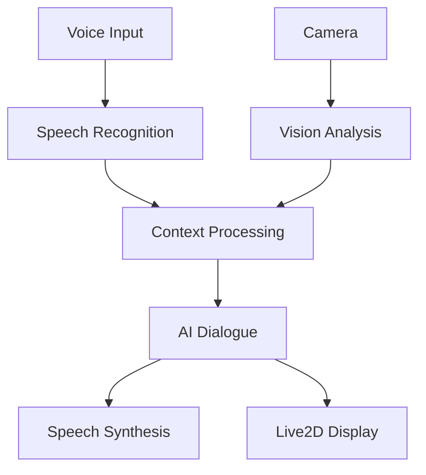

# A.L.I.C.E (Advanced Live Interactive Companion Experience)


A.L.I.C.E is a multimodal AI assistant that integrates voice interaction, computer vision, and Live2D character visualization to provide an immersive AI conversation experience.

## 🎥 Demo

<video width="100%" controls>
  <source src="docs/alice_tiny.mp4" type="video/mp4">
</video>

## ✨ Core Features

- 🗣️ **Real-time Speech Recognition**: Fluid voice recognition powered by SenseVoiceSmall
- 👁️ **Vision Analysis**: Real-time scene understanding and face recognition
- 🎭 **Live2D Character**: Dynamic character visualization
- 🤖 **Intelligent Dialogue**: Context-aware conversations using Phi-4 language model
- 🔊 **Natural Speech Synthesis**: Smooth voice feedback

## ⚠️ Current Limitations

This project is currently in prototype stage with the following limitations:

- No `requirements.txt` file is provided yet
- Models are not automatically downloaded
- Manual setup of dependencies is required

## 🔧 Quick Start

1. Clone repository
```bash
git clone https://github.com/yourusername/alice-agent.git
cd alice-agent
```

2. Install dependencies manually (until requirements.txt is available)
```bash
# Core dependencies (partial list)
pip install streamlit pygame ollama transformers torch
# Additional dependencies may be required
```

3. Download required models manually
```bash
# SenseVoiceSmall ASR model - place in asr_model/SenseVoiceSmall/
# Phi-4 model - ensure Ollama has this model available
# Live2D resources - place in live2d-py/Resources/
```

4. Run application
```bash
streamlit run app.py
```

## 🏗️ Architecture



## 🛠️ Tech Stack

- Speech Recognition: SenseVoiceSmall
- Dialogue Model: Phi-4 (Ollama)
- Vision Analysis: FastSAM
- Frontend: Streamlit
- Character Display: Live2D

## 🚧 Roadmap

- [ ] Provide complete requirements.txt
- [ ] Add automatic model downloading
- [ ] Improve installation process
- [ ] Add comprehensive documentation

## 📝 License

[MIT License](LICENSE)
